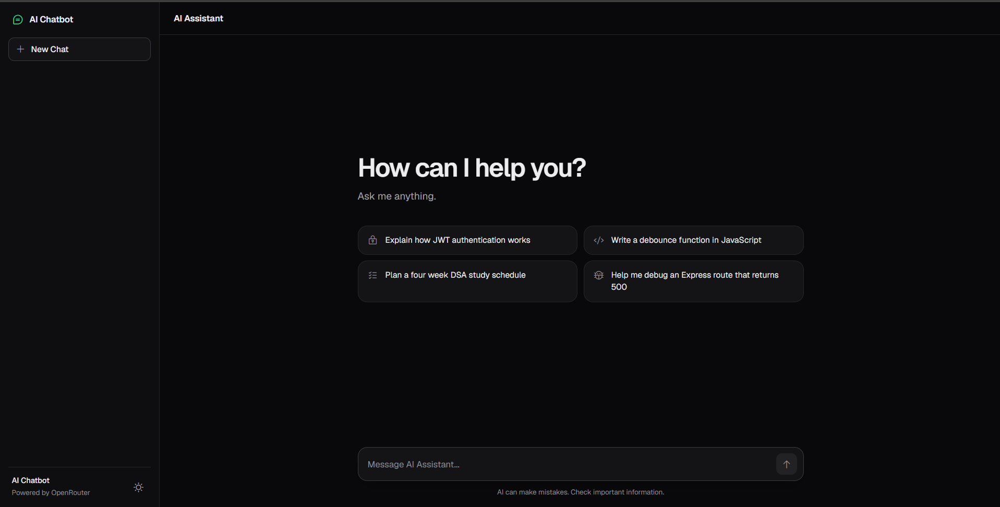
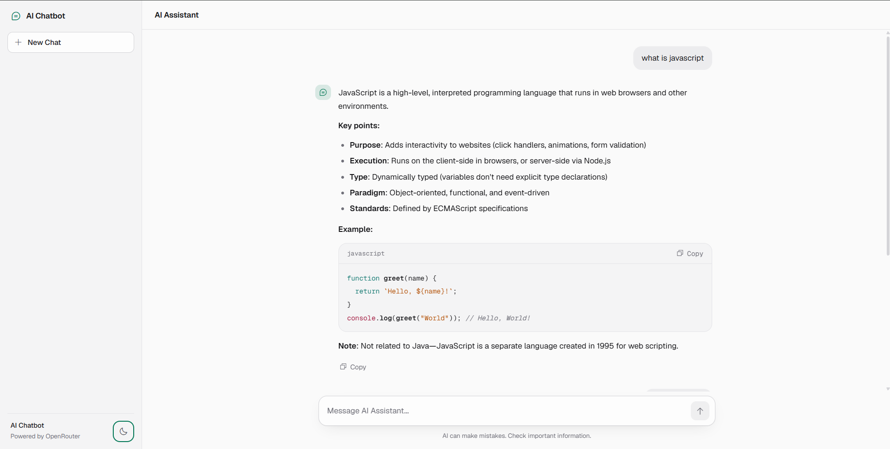

# AI Chatbot

A simple AI chatbot I built from scratch to understand how the different parts of an AI application work together.

The project has a ChatGPT-style interface and uses a Node.js/Express backend to communicate with an AI model through the OpenRouter API.

## Preview

### Dark mode



### Conversation



## Features

- Chat with an AI assistant
- Conversation memory
- Markdown responses
- Formatted code blocks
- Copy code button
- Regenerate response
- Typing indicator
- Stop generation
- New Chat button
- Auto-resizing message box
- Light and dark themes
- Responsive interface

## Tech Stack

- HTML
- CSS
- JavaScript
- Node.js
- Express.js
- Axios
- OpenRouter API

I used plain HTML, CSS and JavaScript for the frontend instead of a frontend framework. This made it easier for me to understand what was actually happening between the browser and the backend.

## How It Works

The basic flow is:

```text
Browser
   ↓
JavaScript
   ↓
Express Server
   ↓
OpenRouter API
   ↓
AI Response
   ↓
Browser